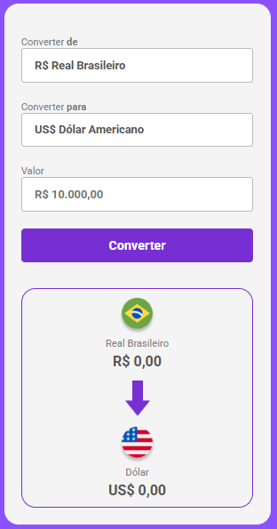

<h1 style="color:#8A51FC;">💱 Conversor de Moedas - FurlanDev</h1>

Um conversor de moedas simples e funcional feito com <strong>HTML, CSS e JavaScript</strong>, que permite converter valores entre <strong>Real (BRL)</strong>, <strong>Dólar (USD)</strong>, <strong>Euro (EUR)</strong> e <strong>Libra Esterlina (GBP)</strong> de forma prática e visual.

<h2 style="color:#772FD3;">⚡ Funcionalidades</h2>
<ul>
  <li>Seleção da moeda de <strong>origem</strong> e <strong>destino</strong>.</li>
  <li>Inserção de valor a ser convertido, aceitando <strong>vírgulas ou pontos</strong>.</li>
  <li>Conversão automática com base em <strong>taxas de câmbio reais</strong> usando API.</li>
  <li>Atualização dinâmica da moeda exibida e do ícone correspondente.</li>
  <li>Interface <strong>responsiva</strong> e intuitiva.</li>
</ul>

<h2 style="color:#772FD3;">📂 Estrutura do Projeto</h2>
<pre style="background-color:#F4F4F4; padding:10px; border-radius:8px;">
conversor-de-moedas/
│
├─ assets/
│   ├─ logo.gif
│   ├─ real.png
│   ├─ dolar.png
│   ├─ euro.png
│   ├─ libra.png
│   └─ seta.png
│
├─ index.html
├─ style.css
├─ scripts.js
└─ README.md
</pre>

<h2 style="color:#772FD3;">📝 HTML (<code>index.html</code>)</h2>

Estrutura principal do projeto com elementos semânticos:

<pre style="background-color:#F4F4F4; padding:10px; border-radius:8px;">
&lt;select&gt; para escolha de moedas, &lt;input&gt; para valor e &lt;button&gt; para converter.
&lt;section&gt; com duas &lt;div class="currency-box"&gt; exibindo o valor da moeda de origem e da moeda convertida.
Imagens e ícones para melhor visualização.
</pre>

<h2 style="color:#772FD3;">🎨 CSS (<code>style.css</code>)</h2>

Estilização do projeto:

<pre style="background-color:#F4F4F4; padding:10px; border-radius:8px;">
* {
  margin: 0;
  padding: 0;
  box-sizing: border-box;
  font-family: "Roboto", sans-serif;
}

body {
  background-color: #8A51FC;
}

main {
  width: 375px;
  background: #F4F4F4;
  border-radius: 20px;
  margin: 0 auto 40px;
  padding: 44px 24px 23px;
}

button {
  background: #772FD3;
  color: #FFFFFF;
  border: none;
  height: 48px;
  width: 100%;
  font-weight: 700;
  cursor: pointer;
}
</pre>

<h2 style="color:#772FD3;">⚙️ JavaScript (<code>scripts.js</code>)</h2>

Principais funções:

<pre style="background-color:#F4F4F4; padding:10px; border-radius:8px;">
1. getRates() - Requisição à API para obter taxas de câmbio atuais.
2. convertValues() - Converte o valor da moeda de origem para a moeda de destino e atualiza o HTML.
3. updateCurrencyBox(selectElement, isToBox) - Atualiza o nome e ícone da moeda selecionada.
</pre>

Event Listeners:

<ul>
  <li>Atualiza automaticamente ícones e nomes das moedas ao alterar o &lt;select&gt;.</li>
  <li>Chama <strong>convertValues()</strong> ao clicar no botão de conversão.</li>
</ul>

<h2 style="color:#772FD3;">🚀 Como Usar</h2>
<ol>
  <li>Clone o repositório:
    <pre style="background-color:#F4F4F4; padding:5px;">git clone https://github.com/Aleksander-Furlan/projeto-conversor-de-moedas.git</pre>
  </li>
  <li>Abra o arquivo <strong>index.html</strong> no navegador.</li>
  <li>Selecione a moeda de origem e destino, insira o valor e clique em "Converter".</li>
  <li>Veja o resultado da conversão na tela, com o valor formatado corretamente.</li>
</ol>

<h2 style="color:#772FD3;">🛠 Tecnologias Utilizadas</h2>
<ul>
  <li>HTML5</li>
  <li>CSS3</li>
  <li>JavaScript (ES6)</li>
  <li>API de câmbio: <a href="https://www.exchangerate-api.com/" target="_blank">ExchangeRate-API</a></li>
</ul>

<h2 style="color:#772FD3;">✨ Próximos Passos / Melhorias</h2>
<ul>
  <li>Adicionar suporte a mais moedas.</li>
  <li>Melhorar responsividade em dispositivos móveis.</li>
  <li>Adicionar animações na conversão.</li>
  <li>Salvar histórico de conversões.</li>
  <li>Adicionar validação avançada de input.</li>
</ul>

 

  

  
